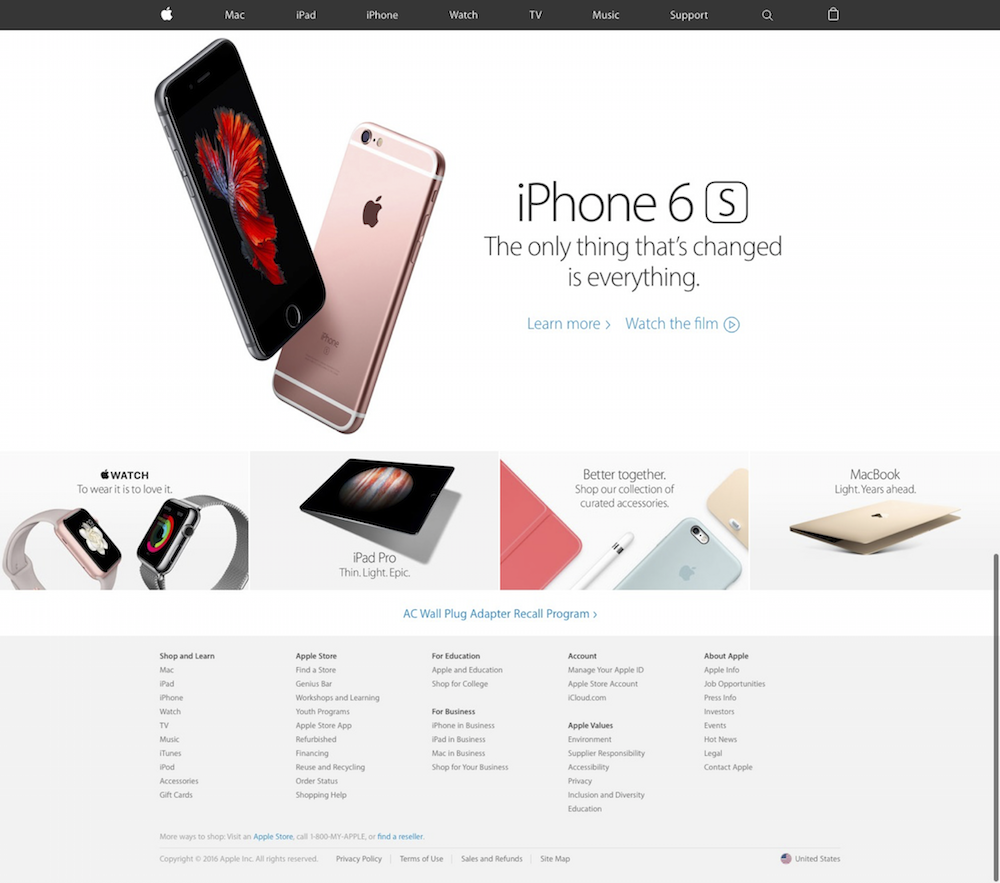

# Apple Clone

For this assignment, we are going to clone the homepage of [apple.com](www.apple.com).


The version we are cloning has older images but the layout of the website is the same.

Go to this [link](https://drive.google.com/file/d/0B2rX-oBIzCi1dnVFSXVIY1V3Nms/view?usp=sharing) to download the files for this project. We have prepared the HTML and CSS files for you with some basic settings and all the images needed are in the "images" folder.

HTML
```
<!DOCTYPE html>
<html lang="en">
<head>
  <meta charset="utf-8">
  <!-- sets the character set your document should use to utf-8 -->
  <title>Apple</title>
  <!-- title tag defines what is shown on the tab of the browser -->
  <link href="style.css" rel="stylesheet" type="text/css">
</head>
<body>
  <header>
    <!-- write your navigation bar here -->
  </header>

  <div>
    <!-- write your hero section here -->
  </div>

  <div>
    <!-- write your sub hero section here -->
  </div>

  <footer>
    <!-- write your footer here -->
  </footer>
</body>
</html>
```

CSS includes the Eric Meyer's CSS reset, borderbox setup and `.clearfix` container setup.

CSS
```
/*            End of CSS Reset            */

/*                 Setup                  */

/*               Borderbox                */
*, *:before, *:after {
  -webkit-box-sizing: border-box;
     -moz-box-sizing: border-box;
          box-sizing: border-box;
}
/* clearfix */
.clearfix:before, .clearfix:after {
  content: "";
  display: table;
}
.clearfix:after {
  clear: both;
}
.clearfix {
  clear: both;
  *zoom: 1;
}
```

You should start with creating the HTML part of the website. Navigation bar, then the hero content, the sub hero content and finally the footer.

You can have a look at the finished cloned site at [apple clone](http://hp-apple-clone.bitballoon.com/).

I have included the Myriad Pro Set font files, to use them, add the following to your CSS file.

```
/*                  Font                  */
@font-face {
  font-family: "Myriad Set Pro";
  src: url("fonts/myriad-set-pro_bold.ttf") format("truetype");
  font-weight: 700;
}
@font-face {
  font-family: "Myriad Set Pro";
  src: url("fonts/myriad-set-pro_semibold.ttf") format("truetype");
  font-weight: 600;
}
@font-face {
  font-family: "Myriad Set Pro";
  src: url("fonts/myriad-set-pro_medium.ttf") format("truetype");
  font-weight: 500;
}
@font-face {
  font-family: "Myriad Set Pro";
  src: url("fonts/myriad-set-pro_text.ttf") format("truetype");
  font-weight: 400;
}
@font-face {
  font-family: "Myriad Set Pro";
  src: url("fonts/myriad-set-pro_thin.ttf") format("truetype");
  font-weight: 300;
}
@font-face {
  font-family: "Myriad Set Pro";
  src: url("fonts/myriad-set-pro_ultralight.ttf") format("truetype");
  font-weight: 100;
}
```

The files for the final cloned example can be downloaded [here](https://drive.google.com/file/d/0B2rX-oBIzCi1TU1tQXZDUXpVWVE/view?usp=sharing)
