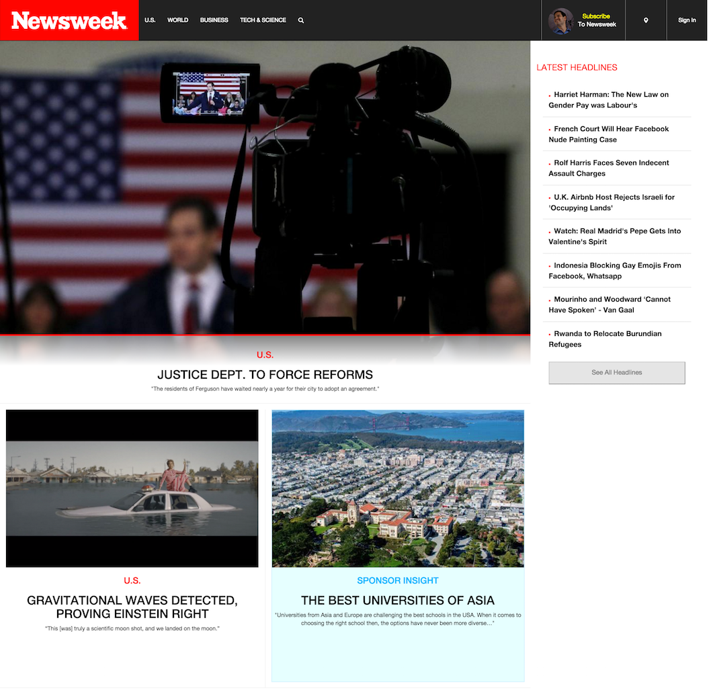
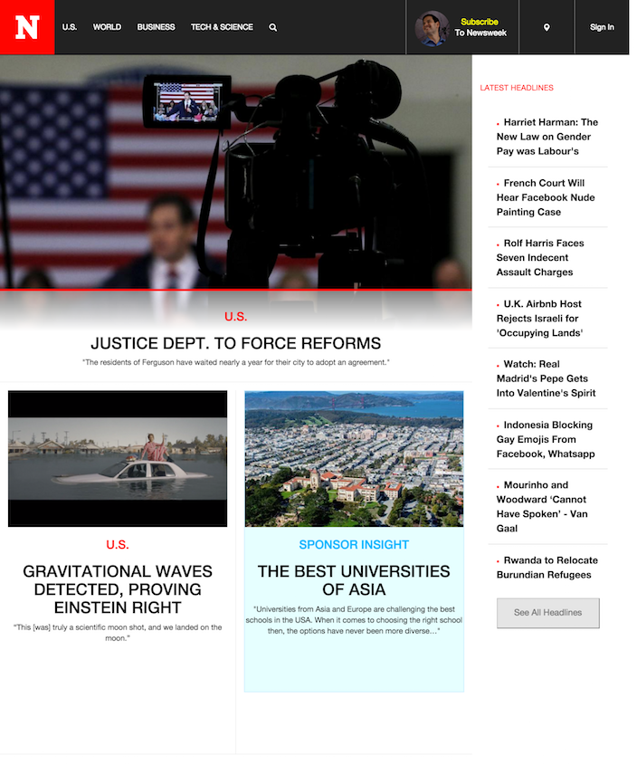
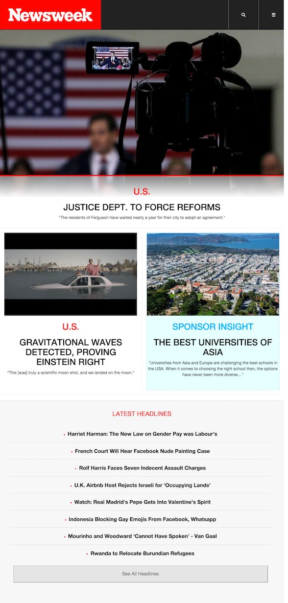
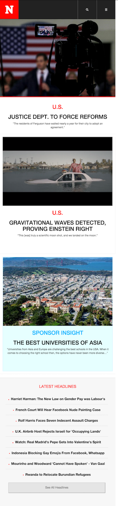

# Newsweek Clone

For assignment 2, you will be cloning [Newsweek](http://www.newsweek.com/).

The version that you will be cloning is a slightly older version and a demo of the solution can be found [here](http://newsweek-clone.bitballoon.com/).

### Go to this [link](https://drive.google.com/a/hackpacific.com/file/d/0B9eYRsYj0-fbNTA2VEV2QmhDekk/view?usp=sharing) to download the files for this project.

We have prepared the HTML and CSS files for you with some basic settings, including a simple navbar. Focus on building out the content of the webpage. Your end product should look something similar to pictures below in different screen sizes.

Large Devices (>= 1200px)

Medium Devices (>= 992px)

Small Devices (>= 768px)

Extra small devices (<768px)

The finished project files can be downloaded [here](https://drive.google.com/a/hackpacific.com/file/d/0B9eYRsYj0-fbek4xSGg4cHlqSFk/view?usp=sharing).
