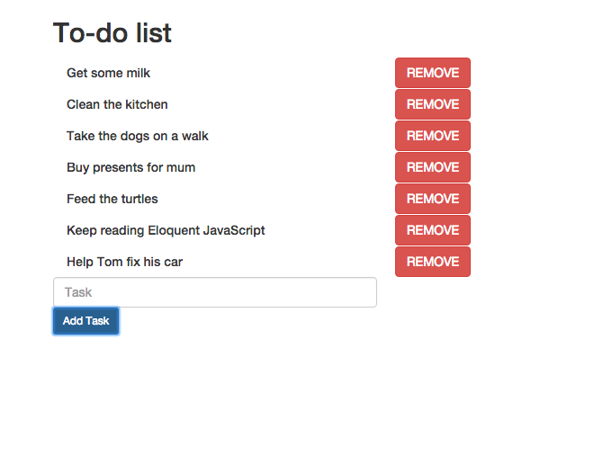

# DOM Manipulation Lab - To Do List

In this lab, we will be creating a simple to-do list, where we use JavaScript to dynamically add and remove elements to and from the DOM (Document Object Model). This will give you a chance to get familiar with how JavaScript can interact with elements on your web page.

## 1. Set Up

First, create a new directory called "todolist". Within that folder, create three files named **todolist.html**, **custom.css**, **application.js** files using and download the latest version of Bootstrap [here](https://getbootstrap.com/getting-started/). This time we are storing the Bootstrap CSS file locally on our computer instead of using CDN. After you downloaded bootstrap, unzip the file and go into the CSS directory. Copy the **bootstrap.min.css** file into your "todolist" directory.

## 2. HTML

In the HTML file, establish links to the CSS and JavaScript files.

HTML
```
<!DOCTYPE html>
<html lang="en">
  <head>
    <title>To-do List</title>
    <link href="bootstrap.min.css" rel="stylesheet">
    <!-- linking bootstrap to you HTML -->
    <link href="custom.css" rel="stylesheet">
    <script src="application.js"></script>
  </head>
  <body>
  <!-- Your codes that displays text on webpage -->
  <!-- <script> Simple JS codes </script> -->
  </body>
</html>
```

If the JavaScript codes are relatively short and simple, we can place the `<script>` tag at the end of `<body>`, and write the required JS codes within `<script>`, keeping HTML and JS codes in the same file. `<script>` is placed at the end (just before the `</body>` tag) if we want all DOM elements to be loaded and ready before we run the JS codes. In this lab, we will be writing the JS part in a separate file, and since we want to wait until all DOM elements are loaded, we can wrap our JS codes in this function:

JS
```(javascript)
document.addEventListener('DOMContentLoaded', function() {

  // Codes placed here will run when the DOM content has loaded.

});
```

Lets define an input element that users can type in their tasks, and a button that takes the input value, saving it to the to-do list:

HTML
```(html)
<!-- Body part of the previous HTML code -->
<body>
  <div class='container'>
    <div class="row">
      <div class="col-xs-12">
        <!-- Title -->
        <h2>To-do list</h2>
        <div class="row">
          <!-- The div where we will display to do list items -->
          <div id="todo-list" class="col-xs-12">
          </div>
          <div class="col-xs-4">
            <!-- The input element for users to add items -->
            <input id="task-detail" class="form-control" placeholder="Task">
            <!-- A button for adding tasks -->
            <button id="addtask-button" type="button" class ="btn btn-sm btn-primary">Add Task</button>
          </div>
        </div>
      </div>
    </div>
  </div>
</body>
```

## 3. JavaScript Add Element

Now, we will write JavaScript to allow the user to add tasks. Open your "application.js" file with Atom, add the following code if you haven't already. The rest of the codes are written within it:

```
document.addEventListener('DOMContentLoaded', function() {

  // Codes placed here will run when the DOM content has loaded.

});
```

In order to manipulate the content inside the DOM, we need a way for our JavaScript code to access the content first. We can access DOM elements with the specified **id** or **class** names using `document.getElementBy`:

```
// Returns the first element with the 'task-detail' id
document.getElementById('task-detail');

// Returns an array of elements with the 'remove-button' class name.
document.getElementsByClassName('remove-button');
```

Lets assign the elements' references to variables for easier access, and a task count to limit the allowed numbers of tasks at a given time.

```
var todoList = document.getElementById('todo-list');
var taskDetail = document.getElementById('task-detail');
var addTaskButton = document.getElementById('addtask-button');
var taskCount = 0;
```

Currently, nothing will happen if we click on the `addtask-button`. Lets define an **addTask** function which will trigger when the button is clicked. This function will take the text user has typed in the input box and add it to the "todo-list" div.

```
// addTask function will dynamically add a div element
// containing the task detail to the todo-list div.

var addTask = function() {
  // The createElement() method creates an Element Node with the specified name.

  // Create a div element and assign it to taskDiv variable.
  var taskDiv = document.createElement('div');

  // Create a h5 element and assign it to the taskH5 variable.
  var taskH5 = document.createElement('h5');

  // Sets the class attribute of taskH5 to take up 4 columns in
  // Bootstrap's grid and a task class that we will add custom styles in CSS.
  taskH5.setAttribute('class', 'col-xs-4 task');

  // Assign the value of taskDetail, which is the text the user typed
  // into the input box, to the innerHTML property of taskH5.
  taskH5.innerHTML = taskDetail.value;

  // Add taskH5 as the last children element to the taskDiv element.
  taskDiv.appendChild(taskH5);

  // Append taskDiv as the last children element to the toDoList div.
  todoList.appendChild(taskDiv);
};
```

Now that we have a function, we need to find a way to invoke this function when the user clicks the "Add Task" button. We must then define an event listener for the button, that will execute a function when a certain event acts on the element (a click event in this case):

```
// This anonymous function will execute when the addTaskButton is clicked.

addTaskButton.onclick = function() {
  // First we make sure that there is less than 10 tasks,
  // and some value exists in the input element.

  if (taskCount < 10 && taskDetail.value !== '') {

    // Executes the addTask function we defined earlier.
    addTask();

    // Add 1 to taskCount.
    taskCount++;

    // Clear the input element by setting it to empty string.
    taskDetail.value = '';
  }
};
```

Now we can add tasks to the to-do list, what if we want to remove them?

## 4. JS Remove Element

Modify our addTask function by adding a **removeButton** next to each "h5" task element. When the removeButton is clicked, the corresponding taskDiv will be deleted.

```
var addTask = function() {
  var taskDiv = document.createElement('div');
  var taskH5 = document.createElement('h5');

  // Create a button element and assign it to removeButton variable.
  var removeButton = document.createElement('button');

  // Set class attribute of removeButton as btn, btn-danger and remove-button.
  removeButton.setAttribute('class','btn btn-danger remove-button');

  // Add the string "REMOVE" into the innerHTML of removeButton.
  removeButton.innerHTML = "REMOVE";

  // Define the event listener so that this taskDiv element
  // will be removed when the user clicks removeButton
  removeButton.onclick = function() {
    // We use 'this' to point to the remove button element.

    // this.parentNode.parentNode will assign the grandparent of
    // removeButton, which is the todo-list div to variable parent
    var parent = this.parentNode.parentNode;

    // this.parentNode will assign the taskDiv to variable child
    var child = this.parentNode;

    // We use the removeChild method to delete taskDiv from the DOM
    parent.removeChild(child);
  });
  taskH5.setAttribute('class', 'col-xs-4 task');
  taskH5.innerHTML = taskDetail.value;
  taskDiv.appendChild(taskH5);

  // Add removeButton as the last children element of taskDiv
  taskDiv.appendChild(removeButton);

  todoList.appendChild(taskDiv);
};
```

## 5. CSS

To make our to-do list a bit more stylish, add the following to the custom.css file:

CSS
```
.remove-button {
  margin-top: 1px;
}

/* This will fade in the new added tasks using the animation property */
.task {
  opacity: 0;
  -webkit-animation: fadeIn .5s linear forwards;
  -moz-animation: fadeIn .5s linear forwards;
  -0-animation: fadeIn .5s linear forwards;
  animation: fadeIn .5s linear forwards;
}

/* you need to define the fadeIn keyframe property for it to work */
@keyframes fadeIn {
  to {
    opacity: 1;
  }
}
```



You can download the files of To Do List [here](https://drive.google.com/file/d/0B2rX-oBIzCi1Q29XLVcya3pMOFk/view?usp=sharing).
