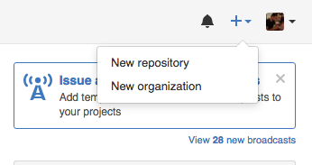
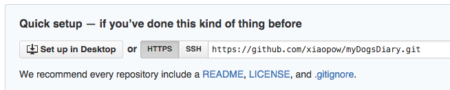
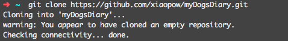
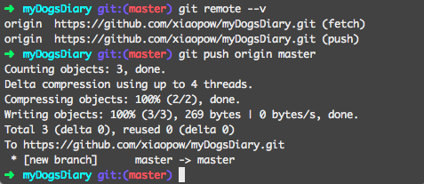
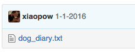

# GitHub Basics

So far, everything we did in Git was done locally, on our computers. What happens when we want to collaborate with others, or save a back up of all your work. We can push (upload) our work to repositories hosted by companies like GitHub.

## 1 Sign Up

Go to https://github.com/ and sign up for an account. GitHub is a platform that lets you manage remote Git repositories. These repositories are stored in GitHub's servers. You can push your local repo (repository) on to GitHub, collaborate with others on the same project. Fork (make a copy of) other people's repos.

## 2 New Remote Repository

Lets create a new remote repository on GitHub. Go to the Home Page, at the top right hand corner, you should see a `+` sign, click it and choose "New repository".



Give your new repo a name, I named mine "myDogsDiary". Then click "Create repository" at the bottom.

Now you are on a Quick setup page. With a few options to choose from. We are going to clone our new repository onto our computer. Make sure your link is HTTPS.



Go to your terminal, navigate back to your home directory `~` and type in the following, except replace your link with mine.

```
git clone https://github.com/xiaopow/myDogsDiary.git
```

This will clone your new remote repository onto your local computer. You should have a folder in your home directory with the same name as your remote repo name. Navigate into your new repo.



Create a new text file `$ touch dog_diary.txt`, open it with sublime and add today's entry "1-1-2016: A new year, a new me, no more biting the sofa.". Save the file. Add the file to staging and make a commit. Now, enter `$ git remote --v` and you will see details of your remote repositories. origin is the name of the remote, this is where your GitHub remote is stored. We can push or local changes up to our remote repository.

```
$ git push origin master
```

`git push` is a git command where we are pushing our local repo to another place. `origin` is the name of the remote, and `master` is the local branch that we want to push. When it's done, your local changes is on GitHub.



If you go back to GitHub and navigate to your repository page, you should see your new file "dog_diary.txt" show up.



Well, that concludes the basics of Git and GitHub. You can go through a simple tutorial by GitHub [tryGit](https://try.github.io/levels/1/challenges/1). For more, you can go through [Git Immersion](http://gitimmersion.com/index.html). **Note** You don't have to install Ruby in order to go through Git Immersion's tutorial, just use `.txt` files instead of `.rb` files.

Below is a cheat sheet for git.

### Git Command

| Key/Command | Description |
|---------|------|
| git init | have git start tracking all code changes in the current folder and all current and future sub-folders |
| git status | get useful information on your git repository: what files you've added, etc |
| git add [-options] | stages your changes |
|  | staging - records all of your code changes to a stage file, also called an index file |
| git log | The history of commits |
| git add -A | stages the changes from **A**ll files  |
| git commit [-options] | takes a snapshot of all your changes and generates a unique identifier for this commit called a HEAD that you can use later to roll back to if needed |
|  | For example, `git commit -m "Completed form validations."` will commit your changes with a short message |
| git stash | saves the state of your half-done work |
| git stash apply | re-apply the state of your half-done work |
| git checkout -b `<branch-name>` | creates a new branch and puts you in it |
|  | For example, `git checkout -b user-login` will create a new branch called "user-login" and any future code will be committed to this branch |
|  | Will not allow creating unless current code has either been committed or stashed |
| git checkout `<branch-name>` | moves you into a new branch |
|  | For example, `git checkout master` will move you into the branch called "master" |
|  | Will not allow creating unless current code has either been committed or stashed |
| git merge [origin-branch-name] | merges code changes from the origin branch into the branch that you are currently in |
|  | For example, If you are currently in the master branch: |
|  | `git merge user-login` will merge all code from your "user-login" branch into your master branch |
| git reset --hard HEAD | resets your code to a previous commit |
|  | WARNING: this command throws away all of your un-committed changes |
|  | For example, `git reset --hard 820f417` |

### Git Command for working with GitHub remotes

| Key/Command | Description |
|---------|------|
| git fetch | imports commits from a remote repository into your local repo |
|  | git fetch `<remote> <branch>` |
|  | For example, `git fetch origin user-login` |
| git merge | ​merges branches after a fetch |
| git pull | **fetch** and **merge** in one command |
|  | For example, ` git pull origin user-login` |
|  | **​fetches** code from your remote origin "user-login" branch and **merges** it with your local code |
| git push `<remote> <branch>` | transfers commits from a local repo to a remote repo |
|  | For example, `git push origin user-login` |
|  | pushes the local code in your "user-login" branch to your remote origin "user-login" branch |
