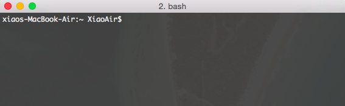
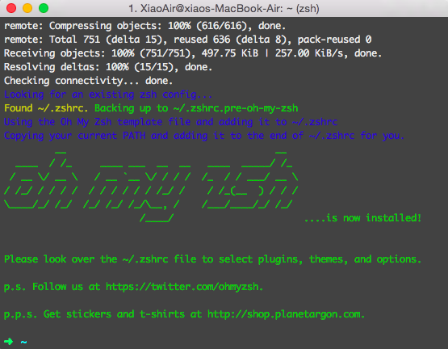

# Install iTerm 2

First go to [iTerm 2's official site](https://iterm2.com/) and download iTerm 2, while you are there, checkout their [features](https://iterm2.com/features.html) and why it would make your life more enjoyable as a programmer.

After installing, open up a new iTerm 2 instance by pressing <kbd>Command + Space</kbd> to open up spotlight and type in `iTerm 2` and press <kbd>Enter</kbd>. You will see the following, which is the same as what you saw in terminal.



Next we will install [Oh My Zsh](https://github.com/robbyrussell/oh-my-zsh), what is Oh My Zsh? Here's an excerpt from their creators.

> Oh My Zsh is a way of life! Once installed, your terminal prompt will become the talk of the town or your money back! Each time you interact with your command prompt, you'll be able to take advantage of the hundreds of bundled plugins and pretty themes. Strangers will come up to you in cafés and ask you, "that is amazing. are you some sort of genius?" Finally, you'll begin to get the sort of attention that you always felt that you deserved. ...or maybe you'll just use the time that you saved to start flossing more often.

To install Oh My Zsh, type the following in your iTerm (we will refer terminal as your iTerm terminal from now on).

```
sh -c "$(curl -fsSL https://raw.github.com/robbyrussell/oh-my-zsh/master/tools/install.sh)"
```

When it finishes, you will see the following.



Notice `-> ~` at the bottom? This is replacing `xiaos-MacBook-Air:~ XiaoAir$`. Things like your computer name and your username are replaced by the `->` but the most important `~` remains because it tells you which directory you are located in currently. Recall what `~` stands for? It stands for your home directory. So you are pretty much setup, type `ls` again in your terminal and see your items show up! We will start looking at how to use the terminal next.
