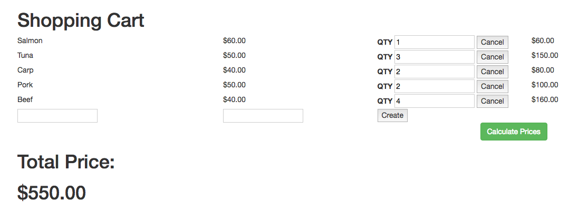

# Simple Shopping Cart with jQuery

For this project, your objective is to create a functioning shopping cart like this [one](http://shoppingcart.bitballoon.com/).

### Go to this [link](https://drive.google.com/file/d/0B2rX-oBIzCi1bmdGcDVhSVJyazQ/view?usp=sharing) to download the files for this project.

Your project needs to satisfy the following criteria:
* Calculate and display the total price.
* Calculate and display the sub total price of each item.
* Allow user to add a new item.
* Allow user to delete an item.

If you have more time, improve its design. Check out this train station themed shopping cart [example](http://xiao-pow-cart.bitballoon.com/).
