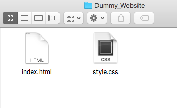

# Setting Up Your Work Environment

Now that you have [Atom](https://atom.io/) text editor installed. Let's go through how to work on HTML and CSS locally on your computer. The first thing you should do is create a folder called "FCC_Front_End_Sprint" in your personal folder to store all your work for this course. Once that is done. Go ahead and create another folder in it called "Dummy_Website". In this folder, create two files, "index.html" and "style.css". Next, open Atom text editor. Click `File > Open` and select the folder "Dummy Website". You should see your folder structure on the left pane. Click on "index.html" to open up the editor. Now paste the following code into "index.html" and save the file.

```
<!DOCTYPE html>
<html lang="en">
<head>
  <meta charset="utf-8">
  <!-- sets the character set your document should use to utf-8 -->
  <title>Dummy Website</title>
  <!-- title tag defines what is shown on the tab of the browser -->
  <link href="style.css" rel="stylesheet" type="text/css">
  <!-- link your CSS file to your HTML file -->
</head>
<body>
  <h1>Hello World</h1>
</body>
</html>
```

To view the HTML file in your web browser ([Google Chrome](www.google.com/chrome‎) or [Firefox](https://www.mozilla.org/en-US/firefox/new/) are great for website development), go to the "Dummy_website" folder and click on the actual "index.html" file.



It should open up in a web browser and you should see "Hello World" on the top left corner.

Change "Hello World" to anything you want and save. Go to your web browser and refresh to see the update. Now you are ready to develop websites locally.
