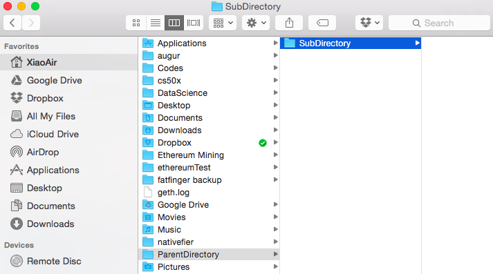
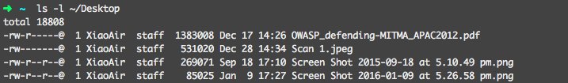
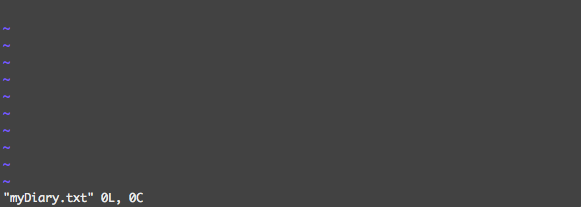
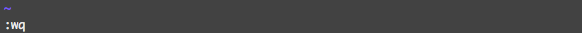
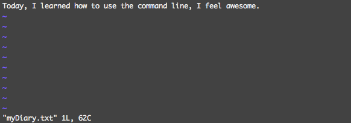

# Terminal Basic Commands

Before we go through the commands, lets look at how your computer is organized. A computer uses a **file system** to organise its files, and folders are actually called **directories**. When a folder is inside another folder, it's called a sub folder, or **subdirectory**. When you have a folder that contains another folder, it's called a **parent directory**. The directory that contains all files and sub directories in your system, is called the **root directory**. Below is the GUI representation of the path `/Users/XiaoAir/ParentDirectory/SubDirectory`.



A **path** is a precise address that represents the location of files and folders in the file system. You navigate through the file system in the terminal using paths. There are two types of paths that your computer will understand, absolute and relative.

An absolute path starts at the root directory and will include all subdirectories up to the point of the location you are specifying. When you use absolute path, you start with a `/` which represents the root directory. It's like using longitude and latitude to locate a place on earth, you start at the root (0,0) and everyone equipped with the destination coordinates and a GPS device will end up at the correct location, say (22,114) for Hong Kong.

A relative path is defined as path related to the **present working directory** (**pwd**), the directory you are located at currently. For `/Users/XiaoAir/OnlineFoundation/SubDirectory`, your present working directory will be `SubDirectory/`. To go to another directory, you will input a path that is relative to your pwd. This is the equivalent of giving directions to a tourist on the streets, the directions will be relative to your current location. Now we have this covered, lets talk about syntax.

## 1. Syntax

Everything has grammar, and so do commands. Each command has three parts, the command (we also call it the utility), the flags (these are options that let you decide how the command is executed), and the arguments (the 'thing' that you are executing on). You always start with the utility, but depending on which command you are using, flags and arguments can be optional.

`$ command flags arguments`

Remember `$` is the prompt, if you installed Oh My Zsh, this will now be gone in your terminal. When typing or copying commands, make sure you **don't** include the `$` prompt. An example using the `ls` command would be `ls -l ~/Desktop`. We have used `ls` before, it is the list utility. `-l` is a flag (option) which stands for "long" and it tells the `ls` command we want to see more information than we normally want to, so `ls` should display the results in a "long" format. The final part, `~/Desktop` is the argument, this is the "thing" we want to execute the command on. You are basically telling the command line, "list out all the content in the Desktop directory in long format". Press <kbd>enter</kbd> and voila.



## 2. Navigation

Anything in capital letters and start with a $ dollar sign, like $THIS, is an argument. Replace $THIS with the argument you want to execute the command on.

**man $UTIL**

man stands for manual. It gives you information on the utility that you specify, if you enter `man ls` it will show you all the information for the `ls` command. Use your up and down arrow keys to scroll, and when you are done, press "Q" to exit.

**pwd**

print working directory. This command will show you the current location starting from the root directory, so it's like a GPS locater.

**ls $DIR**

the list command that we have used several times by now. If you don't specify a $DIR argument, it will list out the content of the current working directory.

**cd $DIR**

change directory. This is the command that lets you navigate the file system. You can either use absolute path or relative path to specify the $DIR argument. `cd /Users/MyName/Desktop` is using the absolute path to bring you to the Desktop directory, no matter where your current working directory is, it will get you there safely. `cd Desktop` is using relative path, you need to already be in `/Users/MyName` for this to work.

Now you know how to move around, I will tell you a few shortcuts that will make your life easier, `cd ..` will bring you one level up to the parent directory of your current directory. `cd ~` will bring you to the Home Folder, or `cd ~/Desktop` will bring you to the Desktop directory without having to write out the entire absolute path starting from root. "~" is a symbol for the home folder if you can recall. "." stands for current folder, and you can use it like this `cd ./Desktop`, this is a relative path.

Before we look at more commands, lets do an exercise. I want you to navigate the file system through the command line. Make sure you begin by quitting and restarting your Terminal. <kbd>Command + Q</kbd> is a Mac shortcut to quit applications. Then do the following.
```
- Start your Terminal application
- Find out where you are
- Navigate to your Downloads folder
- View the contents of your Downloads folder
- Navigate back to your home folder
- Navigate to your Pictures folder
- View the contents of your Pictures folder
- Navigate back to your home folder
```

## 3. File Management

I hope that wasn't too difficult, the more you practice, the better you get. Now lets look at some file manipulation commands.

**touch $FILE**

the touch command lets you create a file in the current working directory. For example, `touch example.txt` will create the example.txt file.

**mkdir $DIR**

make directory. This command will create a specified directory. Fox example, `mkdir NewFolder` creates NewFolder in your current working directory.

**mv $FILE/$DIR $LOCATION**

mv stands for move. This command will move the specified $FILE (or $DIR) to the specified $LOCATION. Same as dragging your files around with the mouse. `mv example.txt SubDirectory` will move the example.txt inside SubDirectory. You can also use this command to rename files like so `mv example.txt stillExample.txt`.

**cp $FILE/$DIR $LOCATION**

cp, copy. This is the equivalent of copy and paste and will copy your specified $FILE (or $DIR) to the specified $LOCATION, keeping the original untouched.

**rm $FILE/$DIR**

rm, remove. This lets you remove (delete) a file or a folder. To delete a file simply type `rm example.txt`. But to delete a folder, you need to add the "-r" flag, `rm -r NewFolder`, this will remove all the files and directories contained inside the target $DIR.

Now you can create, move, copy and remove files and directories. It's time for you to practice, do the following exercise.

```
- Go to your home folder
- Create a file called "myShoppingList.txt"
- Create a folder called "Lists"
- Check that the file and the folder has been successfully created
- Move "myShoppingList.txt" inside "Lists" directory
- Go to "Lists" directory and check the file has been moved
- Rename "myShoppingList.txt" to "myDiary.txt"
- Create a file called "yesterday.txt"
- Remove "yesterday.txt"
- Navigate back to your home folder
```

Practice a few more times until you get the hang of it. Just be careful when using rm, it will happily remove anything you tell it to, so don't use it on anything important, it won't just go to the trash can, it will be gone for ever.

## 4. Text Editing

If you followed the previous exercise correctly, you should have a file called "myDiary.txt" inside your "List" directory. I will now show you how to add your first entry to your diary. There are many ways you can do this but we will mainly look at using vim. if you enter `man vim`, you will see the manual for vim. vim stands for

> vim - Vi IMproved, a programmers text editor

**vim $FILE**

You can use the up down arrow keys to read the menu and when you are done, press "Q" and lets start using vim. First, `cd` to your "List" folder. Check that you have "myDiary.txt" by entering `ls`. If not, go ahead and create it. Then open the file by entering `vim myDiary.txt` and you will see the following.



Vim has opened "myDiary.txt" and is displaying the content, which is currently empty. You should see a blinking cursor on the first line, and at the bottom, you see `"myDiary.txt" 0L, 0C`, which is the file name, the number of Lines and the number of Characters in this file. The '~'s along the left hand side simply means it's an empty line. To start editing the file, press "A" on your keyboard and you will see the bottom line change to `-- INSERT --`.


Type in "Today, I learned how to use the command line, I feel awesome.". Now is the trickier part, after you are done typing, press the "ESC" key on your keyboard. '-- INSERT --' will disappear, type in `:wq`



it will show up where '-- INSERT --' used to be, press enter. Vim will exit and you should be back in the "List" directory. `:wq` `w` stands for write (save), `q` stands for quit, so save and quit. Now lets open up our diary again and see how we have done. `vim myDiary.txt` and enter.



If your terminal looks the same as mine, your edit was saved. "myDiary.txt" currently has 1 Line and 62 Characters in total. To edit again, press "A", to go to the next line, press enter while in `-- INSERT --` mode. When you are done, press "ESC" and type in `:wq` and enter. Well done, you now know how to use vim to edit text files. To make sure you understood everything, do the following exercise.

```
- Open "myDiary.txt" with vim
- Add onto a new line "The weather is nice out side, maybe I should go out and play."
- Save and quit vim
- Go back in and edit the line to say "The weather is nice out side, but
  I prefer learning how to use the command line today."
```

Okay, so you should have a pretty good hang of using the command line. I have provided you with tables of goodies to explore with. The first table is the shortcuts for iTerm 2, it will help you work more efficiently as a programmer. Before I let you go outside and play, enter the following into the terminal `say -v "Good News" "It has been a good day"`. Pretty neat right? Find out more on [making your mac talk](http://www.techradar.com/how-to/computing/apple/terminal-101-making-your-mac-talk-with-say-1305649).

### iTerm 2 Shortcuts
| Key/Command | Description |
|---------|------|
| Cmd + T | Opens a new terminal tab |
| Cmd + C | Copy text in terminal |
| Cmd + V | Paste text in terminal |
| Cmd + D | Create sub-window horizontally |
| Cmd + Shift + D | Create sub-window vertically |
| Ctrl + A | Go to the beginning of the line you are currently typing on |
| Ctrl + E | Go to the end of the line you are currently typing on |
| Ctrl + L | Clears the Screen |
| Command + K | Clears the Screen |
| Ctrl + U | Clears the line before the cursor position. If you are at the end of the line, clears the entire line. |
| Ctrl + H | Same as backspace |
| Ctrl + R | Lets you search through previously used commands |
| Ctrl + C | Kill whatever you are running |
| Ctrl + D | Exit the current shell |
| Ctrl + Z | Puts whatever you are running into a suspended background process. fg restores it. |
| Ctrl + W | Delete the word before the cursor |
| Ctrl + K or R | Clear the line after the cursor |
| Ctrl + T | Swap the last two characters before the cursor |
| Esc + T | Swap the last two words before the cursor |
| Alt + F | Move cursor forward one word on the current line |
| Alt + B | Move cursor backward one word on the current line |
| Tab | Auto-complete files and folder names |

### Core Commands
| Key/Command | Description |
|---------|------|
| cd | Home directory |
| cd [folder] | Change directory |
| cd ~ | Home directory, e.g. ‘cd ~/folder/’ |
| cd / | Root of drive |
| ls | Short listing |
| ls -l | Long listing |
| ls -a | Listing incl. hidden files |
| ls -lla | Listing files with rwx (read, write, execute) information |
| ls -lh | Long listing with Human readable file sizes |
| ls -R | Entire content of folder recursively |
| sudo [command] | Run command with the security privileges of the superuser (Super User DO) |
| open [file] | Opens a file ( as if you double clicked it ) |
| top | Displays active processes. Press q to quit |
| nano [file] | Opens the [file] with nano text editor |
| pico [file] | Opens the [file] with pic text editor |
| q | Exit |
| clear | Clear screen |

### Command History
| Key/Command | Description |
|---------|------|
| history n | Shows the stuff typed – add a number to limit the last n items |
| ctrl-r | Interactively search through previously typed commands |
| ![value] | Execute the last command typed that starts with ‘value’ |
| !! | Execute the last command typed |

### File Management
| Key/Command | Description |
|---------|------|
| touch [file] | Create new file |
| pwd | Full path to working directory |
| .. | Parent/enclosing directory, e.g. |
| ls -l .. | Long listing of parent directory |
| cd ../../ | Move 2 levels up |
| . | Current folder |
| cat | Concatenate to screen |
| rm [file] | Remove a file, e.g. rm [file] [file] |
| rm -i [file] | Remove with confirmation |
| rm -r [dir] | Remove a directory and contents |
| rm -f [file] | Force removal without confirmation |
| rm -i [file] | Will display prompt before |
| cp [file] [newfile] | Copy file to file |
| cp [file] [dir] | Copy file to directory |
| mv [file] [new filename] | Move/Rename, e.g. mv -v [file] [dir] |

### Directory Management
| Key/Command | Description |
|---------|------|
| mkdir [dir] | Create new directory |
| mkdir -p [dir]/[dir] | Create nested directories |
| rmdir [dir] | Remove directory ( only operates on empty directories ) |
| rm -R [dir] | Remove directory and contents |

### Help
| Key/Command | Description |
|---------|------|
| [command] -h | Offers help |
| [command] —help | Offers help |
| [command] help | Offers help |
| reset | Resets the terminal display |
| man [command] | Show the help for ‘command’ |
| whatis [command] | Gives a one-line description of ‘command’ |
