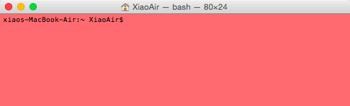
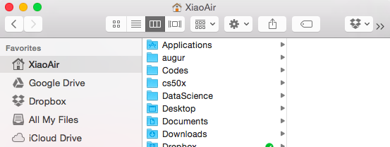
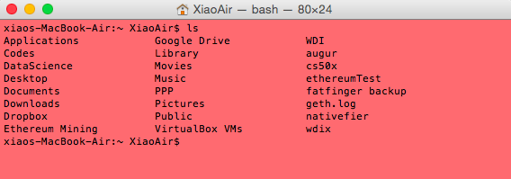

# Why Terminal

If you have never programmed before, you would probably use the computer like everyone would. Accomplishing most tasks by using your mouse / track pad, clicking on folders, dragging your files, navigating menu bars. This type of interaction is utilizing the Graphical User Interface, short named GUI ("gooey"). Everything is very visual, folders and files are displayed in lists and tables, there are easily recognizable icons and you can get most things done without too much effort. Software developers have done a very good job at designing the GUI so a normal person can pick up and learn how to **command** a computer to operate in the fashion they desire, even for a first time user. But things weren't as fancy in the old days. Programmers had to #command# the computer through what's called a Command Line Interface (CLI). The CLI is text based, it requires precise inputs, and it is extremely fast when operated by a seasoned programmer. To this day, CLI is still the preferred method for a programmers. What you see in GUI is actually a visual representation of the CLI.

We use an application called Terminal, also known as shells, to access the CLI, this can be found on all computers. In Online Foundation, we will be teaching you how to use the default shell on Mac OS and Ubuntu Linux, called Bash. If you are using Windows, you can install Ubuntu Linux before you continue, we won't be covering the shell that comes with Windows. Please visit [Ubuntu official site](http://www.ubuntu.com/download/desktop) to learn how to install Ubuntu.

## Terminal

The following shortcuts and commands are for Mac OS.

To start a Terminal, open `Applications > Utilities > Terminal` or use the shortcut <kbd>Command + Space</kbd> to bring up Spotlight and type in "Terminal" and press <kbd>Enter</kbd>.

You see the line `xiaos-MacBook-Air:~ XiaoAir$`. The first part `xiaos-MacBook-Air` is the computer's name, the tilde sign `~` is a symbol for your home directory and should be the same as your username which is `XiaoAir`. The dollar sign `$` is called a **prompt** and basically means the Terminal is ready to accept commands.

Before we move on, lets look at what the GUI equivalent of this CLI state would be. `xiaos-MacBook-Air:~ XiaoAir$` simply means the Terminal is currently in your home folder XiaoAir and you will be able to access any folders and files contained in here. If you open up a new Finder window and select your name, you will see all the items contained in your home folder.

Try this, in your terminal type `ls` and press <kbd>Enter</kbd>, terminal will list out the equivalent in the form of text. You have just used your first command `ls` which means **List**.

The standard Mac Terminal is cool and everything but we want to introduce you to something modern programmers use. So we will help you install iTerm 2 and some other magic next.
